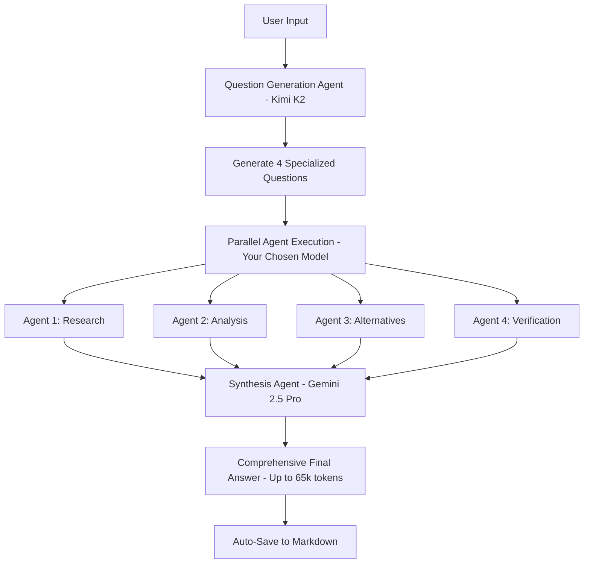

# 🚀 Make It SuperHeavy

A Python framework to emulate **Grok heavy** functionality using a powerful multi-agent system with **advanced multi-model support**. Built on OpenRouter's API, Make It SuperHeavy delivers comprehensive, multi-perspective analysis through intelligent agent orchestration with **multiple AI models**.

## 🌟 Features

- **🧠 Grok heavy Emulation**: Multi-agent system that delivers deep, comprehensive analysis like Grok heavy mode
- **🔀 Parallel Intelligence**: Deploy 4 specialized agents simultaneously for maximum insight coverage
- **🎯 Dynamic Question Generation**: AI creates custom research questions tailored to each query
- **⚡ Real-time Orchestration**: Live visual feedback during multi-agent execution
- **🛠️ Hot-Swappable Tools**: Automatically discovers and loads tools from the `tools/` directory
- **🔄 Intelligent Synthesis**: Combines multiple agent perspectives into unified, comprehensive answers
- **🎮 Single Agent Mode**: Run individual agents for simpler tasks with full tool access
- **🤖 Multi-Model Support**: Choose from Kimi K2, Grok-4, OpenAI o3, and Claude Sonnet 4
- **📝 Auto-Save Output**: Automatically saves results to formatted markdown files
- **🔧 Dynamic Model Switching**: Change AI models on-the-fly during interactive sessions

## 🚀 Quick Start

### Prerequisites

- Python 3.8+
- [uv](https://github.com/astral-sh/uv) (recommended Python package manager)
- OpenRouter API key

### Installation

1. **Clone and setup environment:**
```bash
git clone https://github.com/sanky369/make-it-superheavy.git
cd make-it-superheavy

# Create virtual environment with uv
uv venv

# Activate virtual environment
source .venv/bin/activate  # On Windows: .venv\Scripts\activate
```

2. **Install dependencies:**
```bash
uv pip install -r requirements.txt
# This includes python-dotenv for automatic .env file loading
```

3. **Configure API key:**
```bash
# Copy the example environment file
cp .env.example .env

# Edit .env and add your OpenRouter API key
# OPENROUTER_API_KEY=your_openrouter_api_key_here

# Or set the environment variable directly:
export OPENROUTER_API_KEY=your_openrouter_api_key_here
# On Windows: set OPENROUTER_API_KEY=your_openrouter_api_key_here
```

## 🎯 Usage

### Single Agent Mode

Run a single intelligent agent with **multi-model support**:

```bash
# Use default model (Kimi K2)
uv run main.py

# Use specific model
uv run main.py --model grok-4
uv run main.py --model o3  
uv run main.py --model claude-sonnet-4

# List available models
uv run main.py --list-models
```

**What it does:**
- Loads a single agent with all available tools
- Processes your query step-by-step using your chosen AI model
- Uses tools like web search, calculator, file operations
- Returns comprehensive response when task is complete

**Interactive commands:**
- `models` - List available models
- `switch grok-4` - Switch to different model
- `quit` - Exit the program

### Grok heavy Mode (Multi-Agent Orchestration)

Emulate Grok heavy's deep analysis with 4 parallel intelligent agents using **multiple AI models**:

```bash
# Use default (Kimi K2 orchestrator + Kimi K2 agents)
uv run make_it_heavy.py

# Use specific agent model
uv run make_it_heavy.py --agent-model grok-4
uv run make_it_heavy.py --agent-model o3
uv run make_it_heavy.py --agent-model claude-sonnet-4

# Control output saving
uv run make_it_heavy.py --no-save              # Disable auto-save
uv run make_it_heavy.py --output-dir reports   # Custom output directory

# List available models
uv run make_it_heavy.py --list-models
```

**How Make It SuperHeavy works:**
1. **🎯 AI Question Generation**: Kimi K2 creates 4 specialized research questions from your query
2. **🔀 Parallel Intelligence**: Runs 4 agents simultaneously with your chosen AI model
3. **⚡ Live Progress**: Shows real-time agent status with visual progress bars
4. **🔄 Advanced Synthesis**: Gemini 2.5 Pro combines all perspectives into one comprehensive answer (up to 65k tokens)
5. **📝 Auto-Save**: Automatically saves results to formatted markdown files

**Interactive commands:**
- `models` - List available agent models
- `switch grok-4` - Switch agent model (orchestrator stays Kimi K2, synthesis stays Gemini 2.5 Pro)
- `quit` - Exit the program

**Example Flow:**
```
User Query: "Complete Passive-Income Playbook"

AI Generated Questions (by Kimi K2):
- Agent 1: "Research comprehensive passive income strategies and systems"
- Agent 2: "Analyze beginner-friendly passive income methods with low startup costs"  
- Agent 3: "Find alternative passive income approaches for different skill levels"
- Agent 4: "Verify and cross-check passive income success rates and requirements"

Agents (using Grok-4): Execute specialized research in parallel
Synthesis (by Gemini 2.5 Pro): Combines all perspectives into comprehensive guide (up to 65k tokens)
Output: Saved to outputs/20240115_143025_Complete_Passive_Income.md

Result: Grok heavy-style comprehensive analysis with auto-saved markdown file
```

## 🏗️ Architecture

### Multi-Model Architecture

**Make It SuperHeavy** uses a sophisticated multi-model approach:

- **Orchestrator**: Always uses **Kimi K2** (128k context, optimized for question generation)
- **Synthesis**: Always uses **Gemini 2.5 Pro** (1M context, 65k output, optimized for large-scale synthesis)
- **Agents**: Choose from **Grok-4**, **Kimi K2**, **OpenAI o3**, **Claude Sonnet 4**, or **Gemini 2.5 Pro**
- **Model Factory**: Unified interface for all AI providers
- **Dynamic Switching**: Change agent models during interactive sessions

### Available Models

| Model | Provider | Context Window | Max Output | Recommended For |
|-------|----------|----------------|------------|-----------------|
| **Kimi K2** | OpenRouter | 128,000 tokens | ~8k tokens | Orchestration, Research, Analysis |
| **Grok-4** | OpenRouter | 256,000 tokens | ~8k tokens | Reasoning, Coding, Analysis |
| **OpenAI o3** | OpenRouter | 200,000 tokens | ~8k tokens | Reasoning, Math, Coding |
| **Claude Sonnet 4** | OpenRouter | 200,000 tokens | ~8k tokens | Coding, Reasoning, Analysis |
| **Gemini 2.5 Pro** | OpenRouter | 1,048,576 tokens | 65k tokens | **Synthesis, Large Context Analysis** |

### Orchestration Flow



### Core Components

#### 1. Agent System (`agent.py`)
- **Self-contained**: Complete agent implementation with tool access
- **Agentic Loop**: Continues working until task completion
- **Tool Integration**: Automatic tool discovery and execution
- **Configurable**: Uses `config.yaml` for all settings

#### 2. Orchestrator (`orchestrator.py`)
- **Dynamic Question Generation**: AI creates specialized questions
- **Parallel Execution**: Runs multiple agents simultaneously  
- **Response Synthesis**: AI combines all agent outputs
- **Error Handling**: Graceful fallbacks and error recovery

#### 3. Tool System (`tools/`)
- **Auto-Discovery**: Automatically loads all tools from directory
- **Hot-Swappable**: Add new tools by dropping files in `tools/`
- **Standardized Interface**: All tools inherit from `BaseTool`

### Available Tools

| Tool | Purpose | Parameters |
|------|---------|------------|
| `search_web` | Web search with DuckDuckGo | `query`, `max_results` |
| `calculate` | Safe mathematical calculations | `expression` |
| `read_file` | Read file contents | `path`, `head`, `tail` |
| `write_file` | Create/overwrite files | `path`, `content` |
| `write_output` | Save orchestrator output to markdown | `query`, `result`, `filename` |
| `mark_task_complete` | Signal task completion | `task_summary`, `completion_message` |

## ⚙️ Configuration

Edit `config.yaml` to customize behavior:

```yaml
# OpenRouter API settings
openrouter:
  api_key: "YOUR_OPENROUTER_API_KEY"
  base_url: "https://openrouter.ai/api/v1"
  model: "moonshotai/kimi-k2"  # Default model

# Multi-model configuration
models:
  # Orchestrator model (fixed as kimi-k2)
  orchestrator:
    model_key: "kimi-k2"
    
  # Default model for agents
  default_agent:
    model_key: "kimi-k2"
    
  # Available models for agent selection
  available_agents:
    - "grok-4"
    - "kimi-k2" 
    - "o3"
    - "claude-sonnet-4"

# Agent settings
agent:
  max_iterations: 10

# Orchestrator settings
orchestrator:
  parallel_agents: 4  # Number of parallel agents
  task_timeout: 300   # Timeout per agent (seconds)
  
  # Dynamic question generation prompt
  question_generation_prompt: |
    You are an orchestrator that needs to create {num_agents} different questions...
    
  # Response synthesis prompt  
  synthesis_prompt: |
    You have {num_responses} different AI agents that analyzed the same query...

# Output settings
output:
  directory: "outputs"
  auto_save: true

# Tool settings
search:
  max_results: 5
  user_agent: "Mozilla/5.0 (compatible; OpenRouter Agent)"
```

## 🔧 Development

### Adding New Tools

1. Create a new file in `tools/` directory
2. Inherit from `BaseTool`
3. Implement required methods:

```python
from .base_tool import BaseTool

class MyCustomTool(BaseTool):
    @property
    def name(self) -> str:
        return "my_tool"
    
    @property
    def description(self) -> str:
        return "Description of what this tool does"
    
    @property
    def parameters(self) -> dict:
        return {
            "type": "object",
            "properties": {
                "param": {"type": "string", "description": "Parameter description"}
            },
            "required": ["param"]
        }
    
    def execute(self, param: str) -> dict:
        # Tool implementation
        return {"result": "success"}
```

4. The tool will be automatically discovered and loaded!

### Multi-Model Usage

**Make It SuperHeavy** supports multiple AI models simultaneously:

```python
# Programmatic usage
from model_factory import ModelFactory, ModelAwareAgent

# Create agents with different models
agent_grok = ModelAwareAgent("grok-4")
agent_claude = ModelAwareAgent("claude-sonnet-4")
agent_o3 = ModelAwareAgent("o3")

# Get model information
factory = ModelFactory()
models = factory.get_available_models()
print(models["grok-4"]["display_name"])  # "Grok 4"
```

### Output Management

Automatically saves results to markdown files:

```bash
# Auto-save enabled by default
uv run make_it_heavy.py

# Custom output directory
uv run make_it_heavy.py --output-dir my_reports

# Disable auto-save
uv run make_it_heavy.py --no-save
```

**Output file structure:**
```
outputs/
├── 20240115_143025_Complete_Passive_Income.md
├── 20240115_144512_AI_Development_Trends.md
└── 20240115_151203_React_Optimization.md
```

### Legacy Model Support

For backwards compatibility, single model configuration still works:

```yaml
openrouter:
  model: "anthropic/claude-3.5-sonnet"     # For complex reasoning
  model: "openai/gpt-4.1-mini"             # For cost efficiency  
  model: "google/gemini-2.0-flash-001"     # For speed
  model: "meta-llama/llama-3.1-70b"        # For open source
```

### Adjusting Agent Count

Change number of parallel agents:

```yaml
orchestrator:
  parallel_agents: 6  # Run 6 agents instead of 4
```

**Note**: Make sure your OpenRouter plan supports the concurrent usage!

## 🎮 Examples

### Research Query with Multi-Model Support
```bash
User: "Analyze the impact of AI on software development in 2024"

# Single Agent with Grok-4 (256k context for comprehensive analysis)
uv run main.py --model grok-4
Result: Comprehensive research report with detailed insights

# Multi-Agent with Claude Sonnet 4 (optimized for technical analysis)
uv run make_it_heavy.py --agent-model claude-sonnet-4
Result: 4 specialized perspectives combined into deep, multi-faceted analysis
Output: Auto-saved to outputs/20240115_AI_Software_Development.md
```

### Technical Question with Model Selection
```bash
User: "How do I optimize a React application for performance?"

# Single Agent with Claude Sonnet 4 (excellent for coding tasks)
uv run main.py --model claude-sonnet-4
Result: Step-by-step optimization guide with code examples

# Multi-Agent with Grok-4 (large context for complex technical topics)
uv run make_it_heavy.py --agent-model grok-4
Result: Research + Analysis + Alternatives + Verification = Complete expert guide
Output: Auto-saved to outputs/20240115_React_Optimization.md
```

### Creative Task with OpenAI o3
```bash
User: "Create a business plan for an AI startup"

# Single Agent with o3 (strong reasoning for business planning)
uv run main.py --model o3
Result: Structured business plan with financial projections

# Multi-Agent with o3 (comprehensive business analysis)
uv run make_it_heavy.py --agent-model o3
Result: Market research + Financial analysis + Competitive landscape + Risk assessment
Output: Auto-saved to outputs/20240115_AI_Startup_Business_Plan.md
```

### Model Comparison Example
```bash
# Compare different models for the same task
User: "Explain quantum computing"

# Kimi K2 (excellent for research and comprehensive explanations)
uv run main.py --model kimi-k2

# Grok-4 (strong reasoning for complex topics)
uv run main.py --model grok-4

# OpenAI o3 (excellent for mathematical concepts)
uv run main.py --model o3

# Claude Sonnet 4 (great for technical documentation)
uv run main.py --model claude-sonnet-4
```

## 🛠️ Troubleshooting

### Common Issues

**API Key Error:**
```
Error: Environment variable 'OPENROUTER_API_KEY' not found
Solution: Set the OPENROUTER_API_KEY environment variable with your OpenRouter API key
```

**Tool Import Error:**
```
Error: Could not load tool from filename.py
Solution: Check tool inherits from BaseTool and implements required methods
```

**Synthesis Failure:**
```
🚨 SYNTHESIS FAILED: [error message]
Solution: Check model compatibility and API limits
```

**Timeout Issues:**
```
Agent timeout errors
Solution: Increase task_timeout in config.yaml
```

### Debug Mode

For detailed debugging, modify orchestrator to show synthesis process:

```python
# In orchestrator.py
synthesis_agent = OpenRouterAgent(silent=False)  # Enable debug output
```

## 📁 Project Structure

```
make-it-superheavy/
├── main.py                    # Single agent CLI with multi-model support
├── make_it_heavy.py           # Multi-agent orchestrator CLI with multi-model support
├── agent.py                   # Core agent implementation (legacy)
├── orchestrator.py            # Multi-agent orchestration logic (updated)
├── model_factory.py           # Multi-model abstraction layer
├── config.yaml                # Configuration file (updated)
├── requirements.txt           # Python dependencies
├── README.md                  # This file
├── MULTI_MODEL_GUIDE.md       # Comprehensive multi-model guide
├── test_models.py             # Test suite for all models
├── example_output.py          # Output functionality examples
├── outputs/                   # Auto-saved output files
│   ├── YYYYMMDD_HHMMSS_query1.md
│   ├── YYYYMMDD_HHMMSS_query2.md
│   └── ...
└── tools/                     # Tool system
    ├── __init__.py            # Auto-discovery system
    ├── base_tool.py           # Tool base class
    ├── search_tool.py         # Web search
    ├── calculator_tool.py     # Math calculations  
    ├── read_file_tool.py      # File reading
    ├── write_file_tool.py     # File writing
    ├── write_output_tool.py   # Output saving (new)
    └── task_done_tool.py      # Task completion
```

## 🤝 Contributing

1. Fork the repository
2. Create a feature branch
3. Add new tools or improve existing functionality
4. Test with both single and multi-agent modes
5. Submit a pull request

## 📝 License

MIT License with Commercial Attribution Requirement

**For products with 100K+ users**: Please include attribution to Pietro Schirano and mention the "Make It heavy" framework in your documentation or credits.

See [LICENSE](LICENSE) file for full details.

## 🙏 Acknowledgments

- Built with [OpenRouter](https://openrouter.ai/) for LLM API access
- Uses [uv](https://github.com/astral-sh/uv) for Python package management
- Inspired by **Grok heavy** mode and advanced multi-agent AI systems

---

**Ready to make it SuperHeavy?** 🚀

```bash
# Single agent with multi-model support
uv run main.py --model grok-4

# Multi-agent orchestrator with auto-save
uv run make_it_heavy.py --agent-model claude-sonnet-4

# List all available models
uv run make_it_heavy.py --list-models
```

## 🆕 What's New in SuperHeavy

- **🤖 Multi-Model Support**: Choose from 4 powerful AI models
- **📝 Auto-Save**: Automatically save results to markdown files
- **🔧 Dynamic Switching**: Change models during interactive sessions
- **📋 Comprehensive Documentation**: Complete guide and examples
- **🧪 Testing Suite**: Full test coverage for all models
- **💪 Enhanced Performance**: Better context handling and error recovery

## Star History

[](https://www.star-history.com/#sanky369/make-it-superheavy&Date)
